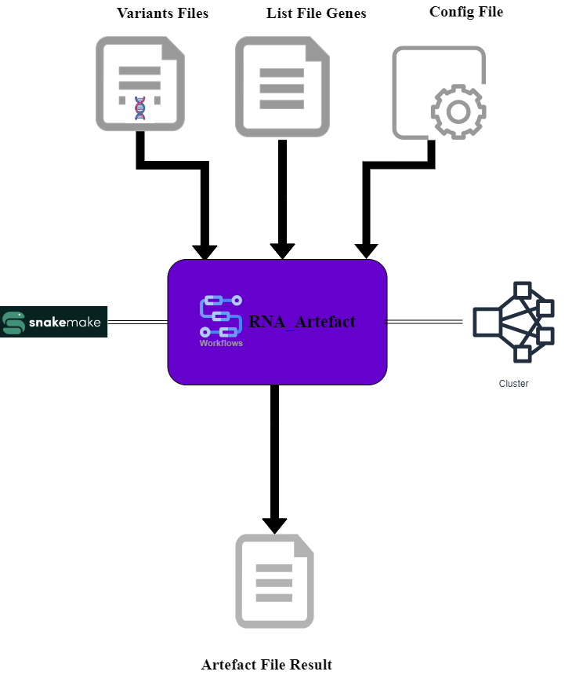

<h1>** Documentation du Pipeline Bioinformatique Rnaseq Artefact **</h1>

## **Vue d'ensemble**
    Ce pipeline bioinformatique utilise Snakemake pour détecter les artefacts dans les données de variants génétiques.
    Il effectue les étapes suivantes :

    Merge les données des variants génétiques des patients.
    Générer des clés pour les mutations (clé=Gene:Chromosome:Position_de_départ:Position_d'arrivée:Allèle_référence:Allèle_alternatif:).
    Calculer la fréquence d'occurrence des mutations chez tous les patients.
    Générer un ficher qui contient toutes les mutations Artefactuelles.

## **Exigences préalables**
### ***Système de gestion d'environnement***
    -Vérifiez si vous avez bien conda sur votre système sinon il faut installer conda.
### ***Env***
    -Pour le cluster de calcul k2so de l'unité bioinfomatique de Bergonié:
        Pas besoin d'installer l'environnement.
    -Autre :
        Il faut installer l'environnment en utilisant cette commande :
            conda env create --file env.yaml
### ***Fichers d'entrées des variants***    
Exemple de fichier [exemple_fichier_variants.txt!](exemples/exemple_fichier_variants.txt)

    - Fichers d'annotation de variants : 
        Un fichier par patient. Le fichier doit contenir au moins pour chaque mutation les colonnes suivantes avec des exemples:
            * GENE (colonne obligatoire) : SAMD11
            * CHROMOSOME (colonne obligatoire) : chr1
            * POSITION DE DEPART DE MUTATION (colonne obligatoire) : 878660
            * POSITION DE FIN DE MUTATION (colonne obligatoire) :   878660 
            * ALLELE DE REFERENCE  (colonne obligatoire) : G
            * ALLELE ALTERNATIF (colonne obligatoire) :  A
            * PROFONDEUR D'ALLELE ALERNATIF (colonne optionnel) : 1   
### ***Ficher de liste de gènes*** 
Exemple de fichier : [exemple_list_gene.txt!](exemples/exemple_list_gene.txt)

    -Ficher de liste de gènes :
        Un fichier qui contient au moins une colonne contenant les noms des gènes
### ***Ficher de configuration***

    -Un fichier qui contient différents paramètres à remplir par l'utilisateur avant de faire tourner le pipeline.
    Paramètres pour gérer les fichiers de variants sur K2so :
        *Project_name (optionnel): vous êtes sur K2so et les fichiers de variants sont stockés sur /scratch/omic_data/projects/ il faut sur indiquer le nom du project (commme MULTIPLI ou Rnaseqpatho) sinon vous laissez vide.
        #path to run analysis:
        current_dir (obligatoire): indiquer le chemin du dossier qui contient le script
        #path input variants files
        input_files(optionnel): vous n'êtes pas sur K2so il faut indiquer le chemin de vos fichiers de variants sinon vous laissez vide.
        colname_chromosome (obligatoire): indiquer le nom de colonne des chromosomes dans le fichier de variants (exemple :"CHROM")
        colname_start_position (obligatoire)  : indiquer le nom de colonne de la position de début de mutation (exemple: "START")
        colname_stop_position (obligatoire) : indiquer le nom de colonne de la position de fin de mutation (exemple: "STOP")
        colname_ref_allele (obligatoire): indiquer le nom de colonne de l'allèle de référence (exemple: "REF")
        colname_alt_allele(obligatoire) : indiquer le nom de colonne de l'allèle alternatif (exemple: "ALT")       
        colname_gene: indiquer le nom de colonne des gènes (exemple: "GENE")
        colname_depth_ALT_allele (optionnel): indiquer le nom de colonne de la profondeur de l'allele alternatif de la mutation    si il n'existe pas vous laissez vide "" (exemple : "MR_DP4_ALT" ).
        threshold_depth_ALT_allele (optionnel) : indiquer la profondeur minimale pour la profondeur de l'alléle alternatif      sinon vous mettez  0 (exemple : 10)
        #input gene file list:
        input_genes_list_file (optionnel): indiquer le chemin pour la liste des gènes sinon vous pouvez laisser vide (exemples: /exemple_list_gene.txt).
        colname_genes_list_genes(optionnel) : indiquer le nom de colonne des gènes de la liste des gènes (exemple :GENE) sinon vous laissez vide . 
        #occurrence mutation
        threshold_occurrence_mutations(obligatoire): indiquer le seuil à appliquer pour les occurences des mutations considérées comme artefactuelles (exemple: 50)
### ***Lancer l'analyse***
    1. Remplir le fichier config.yaml avec les paramètres en question.
    2. Lancer le pipeline via le script Launch_RNA_Artefact.sh (bash  Launch_RNA_Artefact.sh )

### ***Gestion des Erreurs***
    Si le pipeline échoue, vérifiez les logs dans le dossier ./log pour comprendre l'origine du problème.
    Assurez-vous que les chemins vers les fichiers et les paramètres dans le fichier de configuration sont corrects.